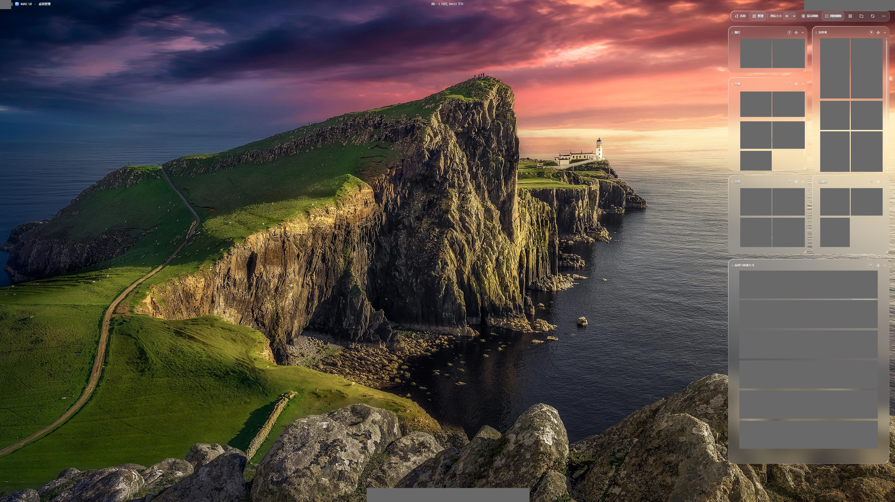
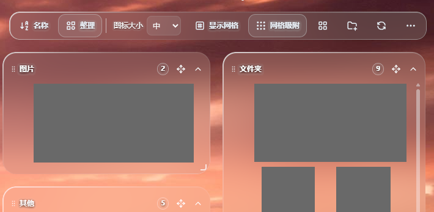
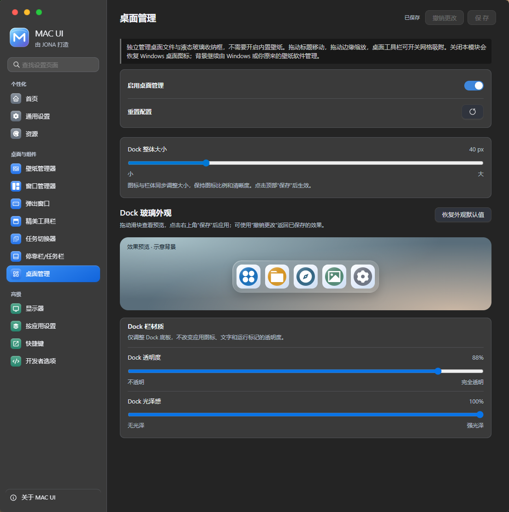
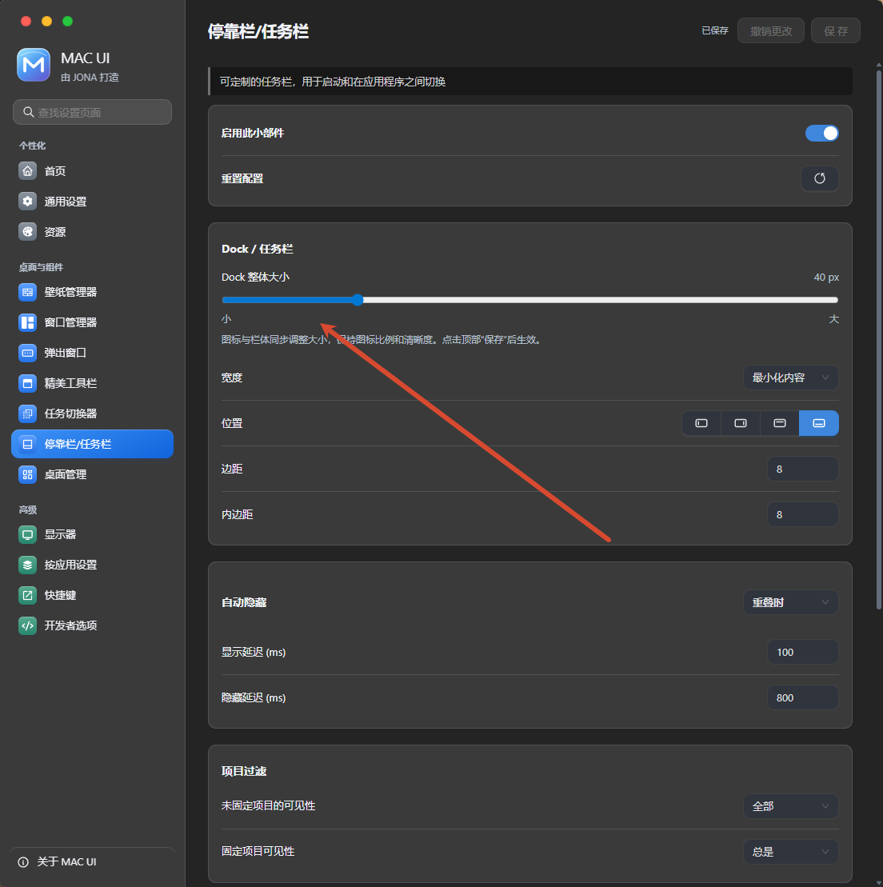
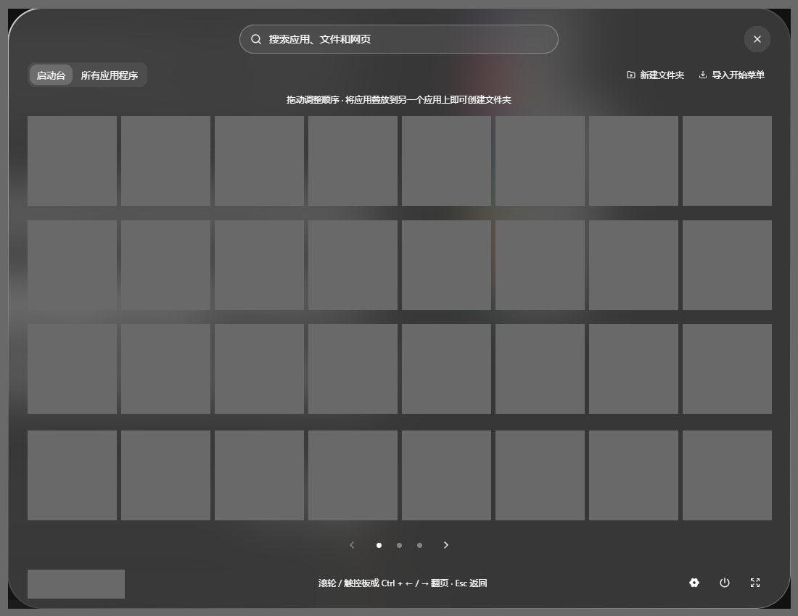
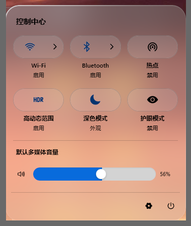
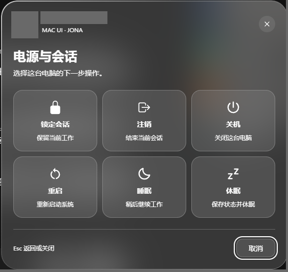

# MAC UI

[English](README.md) | 简体中文

MAC UI 是基于 [eythaann/Seelen-UI](https://github.com/eythaann/Seelen-UI) 独立二次开发的 Windows 桌面定制项目，由 JONA 维护。它提供 macOS 风格的应用网格启动台、桌面整理与统一的磨砂玻璃界面。JONA 负责 MAC UI 的定制贡献；上游作品的作者署名仍属于 eythaann 与 Seelen UI 贡献者。

项目继续采用 **AGPL-3.0-or-later** 许可证。保留上游应用源码、原始资源与署名；排除私有签名材料及构建产物，上游 CI 脚本作为非活动参考归档，不直接用来自动发布 MAC UI。请参阅 [LICENSE](LICENSE)、[NOTICE](NOTICE.md) 和[保留的上游项目介绍](README.upstream.md)。MAC UI 不是 Apple 产品，也不是 Seelen UI 官方发行版。



## 主要功能

- **中性磨砂玻璃。** 内部使用中性透明涂层和原生磨砂，光泽限制在边缘；呈现的颜色来自下层背景，而不是玻璃自身的固定色偏。文字保持清晰，应用图标不添加光晕。
- **可调节 Dock。** 通过滑块分别调节 Dock 整体大小、表面透明度与光泽感。尺寸变化保持图标比例，不拉伸或裁切图标内容。
- **桌面堆栈整理。** 使用可拖动、可缩放的堆栈组织桌面项目，支持网格吸附、折叠和布局保存。
- **macOS 风格启动台。** 在分页应用网格中搜索应用并建立虚拟文件夹；没有快捷访问区域或右侧栏。自制启动台和单独 Win 快捷键均可按需启用。
- **统一系统面板。** 控制中心、Wi-Fi、蓝牙、键盘选择、通知、系统托盘、音量控件、日历、账户与电源面板采用一致的玻璃材质和清晰控件。

### 桌面整理




“桌面管理”页面提供整理模块开关和外观调节。这里的 Dock 控件与 Dock 设置页使用同一组偏好设置。



### Dock 设置

Dock 设置页提供整体大小滑块、位置与布局选项；玻璃透明度和光泽感在“桌面管理”中调节。这些设置影响 Dock 表面与布局，不改变应用图标自身的颜色。



### 启动台



在设置中启用自制启动台及其快捷键后，可单按 Win 打开或关闭。它仅在松键时触发，同时支持左右 Windows 键，不会将 Win+E、Win+D 等组合键识别为单按启动台快捷键。已经保存的自定义绑定仍会保留；全新配置在启用自制启动台前继续使用原生 Windows 开始菜单。详情见[启动台文档](documentation/LAUNCHPAD.md)。

### 控制中心与会话操作





电源与会话操作使用独立面板，确认流程默认优先取消。材质、无障碍与验证说明见[系统面板文档](documentation/MAC-PANELS.md)。

截图用于介绍界面。个人应用、文件、文件夹、账户、托盘细节及无关背景内容使用不透明色块遮盖，遮盖区域外的每个像素均保留；桌面管理和 Dock 设置两张截图不含私人数据，按原样展示。

## 3.0.1 更新

3.0.1 修复 Win 快捷键相关流程，保持已经验收的 3.0 视觉设计不变：

- 在快捷键设置中增加明确的启动台启用开关，录制绑定时支持单独 Win。
- 同步初始化与文件更新中的快捷键设置，停用后重新启用时继续使用有效的键盘监听。
- 通过独立请求编号隔离快捷键录制、完成与取消，避免旧录制请求误取消新请求。

**Genie 神奇吸入式最小化动画仍是未启用的实验原型。** 正常最小化继续使用 Windows 原生行为，不能将它视为已经完成并验收的 macOS Genie 替代实现。详情见 [Genie 状态与限制](documentation/GENIE-MINIMIZE.md)。

## 安装与更新

请从 [MAC UI 3.0.1 发布页面](https://github.com/ximu5004-source/MAC-UI/releases/tag/v3.0.1) 获取 **Windows x64** 安装包及对应校验信息，并保留 Microsoft Edge 与 WebView2 运行时。上游 Seelen UI 的下载、Microsoft Store 安装包和 Winget 条目不包含 MAC UI 的定制内容。

**MAC UI 安装包没有 Authenticode 代码签名。** Windows 可能提示发布者未知；请核对仓库来源、发布说明与 SHA-256 校验值，再决定是否安装。产品信息中的 JONA 署名不等于可信数字签名，内部资源签名也不能替代 Authenticode。

目前采用手动更新。为避免 MAC UI 被原版 Seelen UI 替换，上游应用自动更新安装已禁用。兼容标识和既有应用数据路径保留；升级前建议备份配置。

MAC UI 不安装或配置 Windhawk，也不替换 Windows 系统文件；定制由自己的应用及辅助组件提供。Seelen 账户和资源市场仍属于上游服务，并非 MAC UI 运营的服务。

## 开发

原生部分使用 Rust 与 Tauri，界面使用 TypeScript 及 Svelte 或 React。Windows 开发环境需要 Node.js 和 npm、Deno、Rust MSVC 工具链、Microsoft C++ Build Tools、Windows SDK，以及 WebView2。

准备好工具链后，在仓库根目录运行：

```powershell
npm install
npm run build:ui
npm run type-check
cargo check --workspace
npm run dev
```

`npm install` 会通过仓库的 preinstall 脚本构建本地 core 库。`npm run dev` 构建调试版原生组件并启动 Tauri 开发流程。日常 Rust 验证应优先使用 `cargo check`，不必构建发布版。

生产打包还需要满足 [src/build.rs](src/build.rs) 中的完整性签名要求。私有签名材料不会随仓库分发，使用自己的完整性信任密钥需要相应配置。上述命令只是开发入口，不代表从全新检出即可复现官方可信签名安装包。修改原生或打包行为前，请阅读 [AGENTS.md](AGENTS.md) 和[定制说明](documentation/MAC-UI.md)。

## 文档与署名

- [MAC UI 定制与版本记录](documentation/MAC-UI.md)
- [启动台](documentation/LAUNCHPAD.md)
- [系统面板](documentation/MAC-PANELS.md)
- [Genie 原型状态](documentation/GENIE-MINIMIZE.md)
- [上游项目](https://github.com/eythaann/Seelen-UI)与[保留的上游项目介绍](README.upstream.md)
- [许可证](LICENSE)与[版权声明](NOTICE.md)

反馈问题时，请提供 MAC UI 版本、Windows 版本、显示缩放比例和复现步骤，并遮盖截图中的账户、网络及个人文件信息。MAC UI 定制相关问题请提交到[本仓库](https://github.com/ximu5004-source/MAC-UI/issues)，不要将这个独立分支表述为上游官方发行版。
